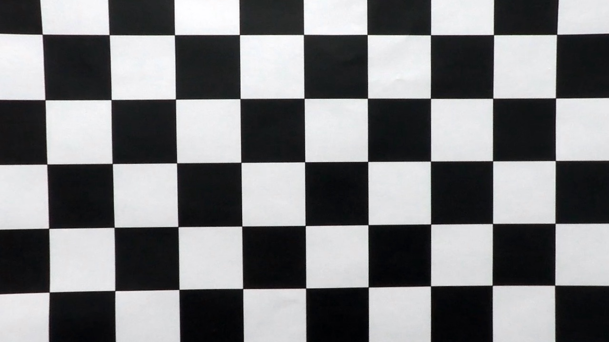
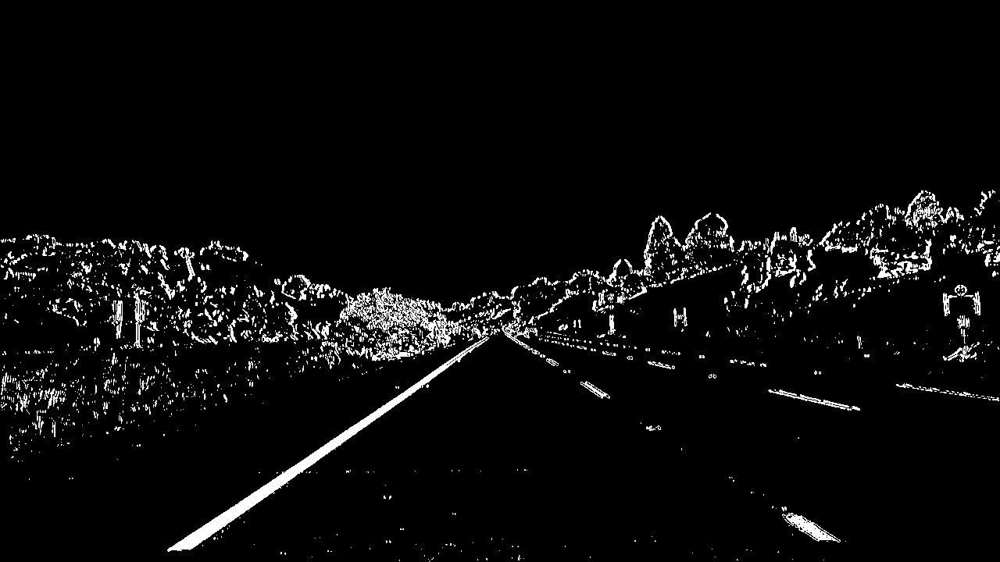
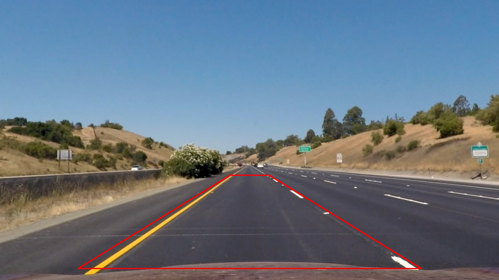
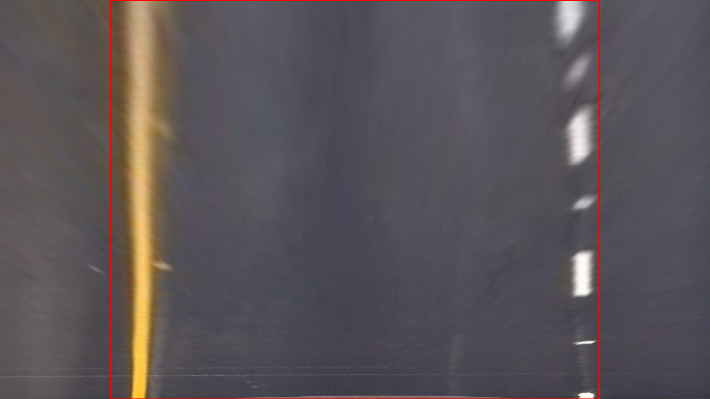
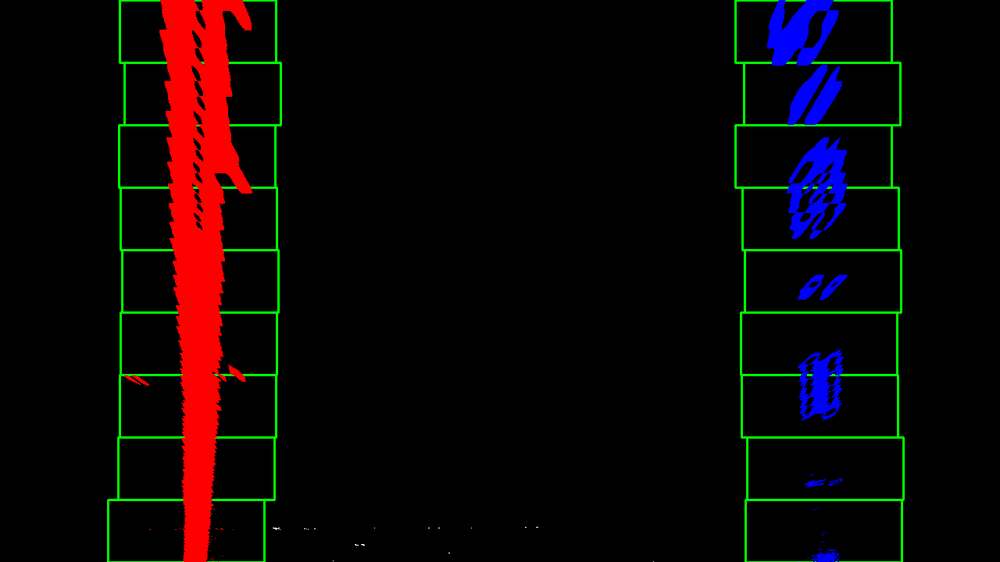
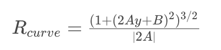
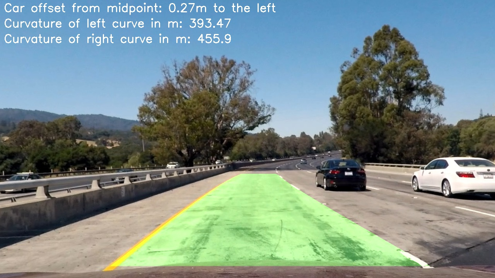

**Advanced Lane Finding Project**

The goals / steps of this project are the following:

* Compute the camera calibration matrix and distortion coefficients given a set of chessboard images.
* Apply a distortion correction to raw images.
* Use color transforms, gradients, etc., to create a thresholded binary image.
* Apply a perspective transform to rectify binary image ("birds-eye view").
* Detect lane pixels and fit to find the lane boundary.
* Determine the curvature of the lane and vehicle position with respect to center.
* Warp the detected lane boundaries back onto the original image.
* Output visual display of the lane boundaries and numerical estimation of lane curvature and vehicle position.

## [Rubric](https://review.udacity.com/#!/rubrics/571/view) Points

### Here I will consider the rubric points individually and describe how I addressed each point in my implementation.  

---

### Writeup / README

#### 1. Provide a Writeup / README that includes all the rubric points and how you addressed each one.  You can submit your writeup as markdown or pdf.  [Here](https://github.com/udacity/CarND-Advanced-Lane-Lines/blob/master/writeup_template.md) is a template writeup for this project you can use as a guide and a starting point.  

You're reading it!

### Camera Calibration

#### 1. Briefly state how you computed the camera matrix and distortion coefficients. Provide an example of a distortion corrected calibration image.

The code for this step is or in lines 8 through 33 of the file called `P4.py`.  

The chessboards that I am trying to find are 9 by 6 chessboards. The pictures are first turned into grayscale then I use the openCV function findChessboardCorners and this function returns True if the corners are found and also the position of the detected corners.

What we know of the image after the findChessboardCorners is used is the following:

objectPoint: 3d point in real world space these object points prepared by me and are the x,y,z coordinates of the chessboard corners in the world. I am assuming the chessboard is fixed on the (x,y) plane at z=0.
 
imagePoint: 2d points in image plane, this is the output from the findChessboardCorners function.

The objectPoint and imagePoint is then used in the openCV function calibrateCamera which returns the camera matrix, the distortion coefficients etc.

See below for an image that is distorted and then a undistorted image.





### Pipeline (single images)

#### 1. Provide an example of a distortion-corrected image.

To demonstrate this step, I will describe how I apply the distortion correction to one of the test images like this one:

#### 2. Describe how (and identify where in your code) you used color transforms, gradients or other methods to create a thresholded binary image.  Provide an example of a binary image result.

I used a combination of color and gradient thresholds to generate a binary image (thresholding steps at lines 37 through 72 in `P4.py` in function `color_gradient()`). Here's an example of my output for this step. 



#### 3. Describe how (and identify where in your code) you performed a perspective transform and provide an example of a transformed image.

The code for my perspective transform includes a function called `perspective_transform()`, which appears in lines 75 through 104 in the file `P4.py`.  The `perspective_transform()` function takes as inputs an image (`img`). I chose the hardcode the source and destination points in the following manner:

```python
offsetX1 = 200
offsetX2 = 590
src = [[offsetX1, 690],
	   [offsetX2, 450],
	   [1280 - offsetX2, 450],
	   [1280 - offsetX1, 690]]

src = np.float32(src)

offsetX = 200
dst = [[offsetX, 720],
	   [offsetX, 0],
	   [1280 - offsetX, 0],
	   [1280 - offsetX, 720]]
dst = np.float32(dst)
```

This resulted in the following source and destination points:

| Source        | Destination   | 
|:-------------:|:-------------:| 
| 200, 690      | 200, 720        | 
| 590, 450      | 200, 0      |
| 690, 450     | 1080, 0      |
| 1080, 690      | 1080, 720        |

I verified that my perspective transform was working as expected by drawing the `src` and `dst` points onto a test image and its warped counterpart to verify that the lines appear parallel in the warped image.




#### 4. Describe how (and identify where in your code) you identified lane-line pixels and fit their positions with a polynomial?

First I used windows of the picture and then used a histogram to find the different lane line pixels by using the top two values in the histogram as the left and right line pixels. Then I used the data for the left and right lane correspondingly to use numpys polyfit to fit the data with a polynomial. As described in the lectures. 

The code can be found in line 99 to 177 in `P4.py`.



#### 5. Describe how (and identify where in your code) you calculated the radius of curvature of the lane and the position of the vehicle with respect to center.

I did this in lines 213 through 224 in my code in `P4.py`.

First I used the data where the lane-lines pixels were located then I changed the values of the pixels to match real-world instead of image world. Then I fit their position with a polynomial. Then I used the following formula to calculate the radius:



The source of this formula is from the Udacity lecture *Measuring Curvature*.

#### 6. Provide an example image of your result plotted back down onto the road such that the lane area is identified clearly.

I implemented this step in lines 227 through 270 in my code in `P4.py` in the function `plot_lines()`.  Here is an example of my result on a test image:



---

### Pipeline (video)

#### 1. Provide a link to your final video output.  Your pipeline should perform reasonably well on the entire project video (wobbly lines are ok but no catastrophic failures that would cause the car to drive off the road!).

Here's a [link to my video result using the normal project video](./project_video.mp4)

---

### Discussion

#### 1. Briefly discuss any problems / issues you faced in your implementation of this project.  Where will your pipeline likely fail?  What could you do to make it more robust?

The pipeline could most likely be better if I applied smoothing to the lines for example averaging over a couple of images.

The sanity check I used was to check the distance between the left and right lane close to the car, then check the distance between the left and right lane far away from the car. If those two distances was within +-5% of each other I would accept the result and let the result from the optimized sliding window be accepted otherwise I would perform the original sliding window. This sanity check could probably be improved. 

When testing my pipeline on the challenge and the harder challenge the result is very poor and in the challenge video I believe it is due to it determining the wrong white line being the left line. This could be improved by using an other filter method or adaptive filter method. 

For the harder challenge I would have needed an adaptive length of the detected lines as well as not fit the data to a 2nd degree polynominal but maybe a 3rd degree polynominal.
